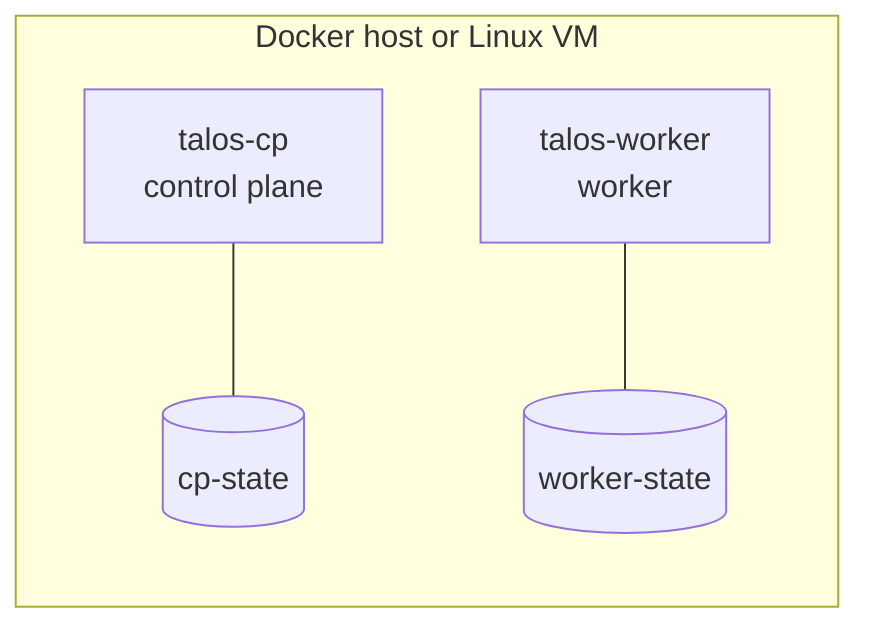

# Talos Container Lab

[](LICENSE)
[](https://www.talos.dev/)

**Two Talos Linux nodes from one `docker compose up`, with no spare hardware
and no hypervisor templates.**

A small Docker Compose lab for exploring how
[Talos Linux](https://www.talos.dev/) behaves as a container: one
control-plane node and one worker, each with its own persistent state volume,
on read-only root filesystems.

> **Lab scaffold, not a Kubernetes cluster.** Compose starts the two Talos
> containers. Machine configuration, control-plane bootstrap, networking and
> workloads are deliberately left to you.

[Quick start](#quick-start) ·
[What you get](#what-you-get) ·
[Take it further](#take-it-further-bootstrap-kubernetes) ·
[Safety](#safety-notes) ·
[Contributing](#contributing)

## Why try it

- **Cheap to start, cheap to throw away.** Two containers and two named
  volumes. `docker compose down --volumes` puts you back at zero.
- **Pinned.** Both nodes run `ghcr.io/siderolabs/talos:v1.7.4`.
- **Hardened where it can be.** Read-only root filesystems, with writable
  paths limited to tmpfs mounts and named volumes.
- **No surprise exposure.** The Compose file publishes no ports and manages
  no secrets.
- **A prepared workspace.** The dev container adds talosctl v1.7.4, kubectl and
  Docker-in-Docker.

## What you get



| Service | Image | State | Notes |
| --- | --- | --- | --- |
| `talos-cp` | `ghcr.io/siderolabs/talos:v1.7.4` | `cp-state` volume | Privileged, `seccomp=unconfined`, read-only root |
| `talos-worker` | `ghcr.io/siderolabs/talos:v1.7.4` | `worker-state` volume | Same settings as the control plane |

The repository has no screenshots or images; the diagram above is the visual.

## Quick start

### Requirements

- Docker Engine with Compose v2
- A Linux host or Linux VM that allows privileged containers
- Enough CPU and memory for two Talos containers

Docker Desktop and other virtualized runtimes may restrict privileged
containers. You can validate the Compose file on macOS or Windows, but run the
nodes in a Linux VM if they can't reach the kernel features they need.

### 1. Validate without starting anything

```bash
git clone https://github.com/T-Py-T/talos-cluster-testing.git
cd talos-cluster-testing
docker compose config
```

This resolves the YAML, service references, volumes and interpolation, and
creates nothing. Run with Docker Compose v5.5.1, it resolved cleanly to two
services (`talos-cp`, `talos-worker`) and two named volumes (`cp-state`,
`worker-state`), with no published ports.

`podman-compose` 1.6.0 couldn't parse this file: it rejects the anonymous
`type: volume` mounts with `KeyError: 'source'`. Use Docker Compose v2.

### 2. Start the nodes

> Not run as part of this README update. These containers are privileged, so
> run them only on a machine or disposable VM you control.

```bash
docker compose pull
docker compose up -d
docker compose ps
docker compose logs --tail=100
```

At this point you have two running Talos containers, not a working Kubernetes
control plane.

### 3. Stop or reset

```bash
docker compose down            # stop; keep node state
docker compose down --volumes  # destructive reset; deletes node state
```

## Take it further: bootstrap Kubernetes

If your experiment needs a cluster, continue with the standard Talos flow from
inside the dev container. These are starting points, not a tested recipe:

```bash
talosctl gen config talos-lab https://<CONTROL_PLANE_IP>:6443
talosctl apply-config --insecure --nodes <CONTROL_PLANE_IP> --file controlplane.yaml
talosctl bootstrap --nodes <CONTROL_PLANE_IP>
talosctl kubeconfig --nodes <CONTROL_PLANE_IP>
```

Generated machine configs and kubeconfigs contain secrets, so keep them out of
Git. See the [dev container guide](.devcontainer/README.md) for finding node IP
addresses.

## Dev container

Open the repository in VS Code with the Dev Containers extension (or with
DevPod). Setup installs talosctl v1.7.4, and the container features add
kubectl, Helm, Git, GitHub CLI and Docker-in-Docker. Details are in
[`.devcontainer/README.md`](.devcontainer/README.md).

## Repository layout

| Path | Purpose |
| --- | --- |
| [`compose.yaml`](compose.yaml) | Two-node Talos container topology and storage mounts |
| [`.devcontainer/`](.devcontainer) | Workspace with talosctl, kubectl and Docker-in-Docker |
| [`SECURITY.md`](SECURITY.md) | Vulnerability reporting and supported branch |
| [`LICENSE`](LICENSE) | License retained from the original lab scaffold |

## Safety notes

- The services are privileged with an unconfined seccomp profile. Run the lab
  only on a machine or disposable VM you control.
- Named volumes keep node state between runs. Treat `down --volumes` as a
  destructive reset.
- The Compose file doesn't manage secrets, expose a Kubernetes API port or
  configure production networking.
- Report vulnerabilities privately as described in [SECURITY.md](SECURITY.md),
  not in public issues.

## Contributing

Issues and pull requests are welcome, especially reports of host
compatibility on different runtimes. Run `docker compose config` before you
open a pull request, and never commit machine configs, kubeconfigs or other
generated secrets.

## License

Available under the [MIT License](LICENSE), retained from the original lab
scaffold.
